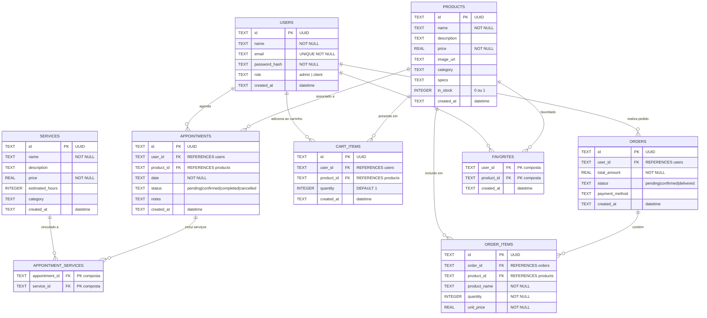

# AstroMachine — Diagrama Entidade-Relacionamento (DER) — Fase 2

## Diagrama Mermaid

## Explicação das Relações

| Relação | Descrição |
|---------|-----------|
| `USERS → APPOINTMENTS` | Um usuário (cliente) pode ter vários agendamentos de montagem/customização |
| `USERS → CART_ITEMS` | Um usuário pode ter vários itens no carrinho |
| `USERS → ORDERS` | Um usuário pode realizar vários pedidos |
| `USERS → FAVORITES` | Um usuário pode favoritar vários produtos |
| `PRODUCTS → CART_ITEMS` | Um produto pode estar no carrinho de vários usuários |
| `PRODUCTS → ORDER_ITEMS` | Um produto pode aparecer em vários pedidos |
| `PRODUCTS → APPOINTMENTS` | Um agendamento pode estar associado a um produto (build) específico |
| `SERVICES → APPOINTMENT_SERVICES` | Relação N:N — um agendamento pode incluir vários serviços |
| `ORDERS → ORDER_ITEMS` | Um pedido contém vários itens |

## Entidades Obrigatórias da Fase 2

1. **Usuários (USERS)**: Cadastro de administradores e clientes
2. **Produtos (PRODUCTS)**: Builds e PCs personalizados com temática espacial
3. **Serviços (SERVICES)**: Customizações como pintura, iluminação RGB, gravação
4. **Agendamentos (APPOINTMENTS)**: Solicitações de montagem/customização de PCs

## Tabelas Auxiliares

- **CART_ITEMS**: Itens adicionados ao carrinho antes da compra
- **ORDERS / ORDER_ITEMS**: Pedidos finalizados via checkout
- **APPOINTMENT_SERVICES**: Tabela associativa N:N entre agendamentos e serviços
- **FAVORITES**: Produtos favoritos do usuário

## Schema SQLite

O schema completo está implementado em:
- `mobile/src/db/database.ts` — inicialização do banco com CREATE TABLE e seed data
- O banco é criado automaticamente na primeira execução do app
